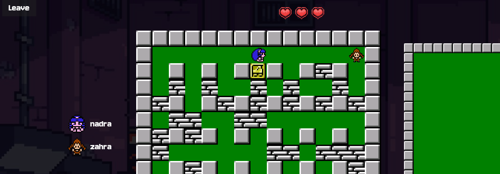

# Bomberman Multiplayer Game


**Bomberman Multiplayer** is a browser-based multiplayer game inspired by the classic Bomberman. Players can join a lobby, chat with others, and compete in real-time to blow up blocks and opponents.

---

## Features

* **Multiplayer Support**
  Real-time multiplayer gameplay using WebSockets.

* **Lobby System**
  Players enter their name and join a lobby before the game starts.

* **Chat System**
  Integrated chat for both lobby and in-game communication.

* **Dynamic Player List**
  See connected players with avatars and their statuses.

* **Responsive Design**
  Works on desktop and mobile devices with adaptive scaling.

* **Pixelated Graphics**
  Classic Bomberman look and feel with pixel-art style.

---

## Demo

*comming soon*

---

## Installation

1. **Clone the repository**

```bash
git clone https://github.com/nadra03/bomberman.git
cd bomberman
```

2. **Install dependencies**

```bash
npm install
```

3. **Run the development server**

```bash
npm start
```

4. **Open your browser**

Navigate to `http://localhost:3000` (or the port specified) to play.

---

## Folder Structure

```
bomberman/
├── public/           # HTML, CSS, JS assets
│   ├── img/            
│   ├── sound/         
│   └── js/         
├── backend/            # Node.js WebSocket server
│   └── server.js
├── index.html      
└── README.md

```

---

## Gameplay Instructions

1. Enter your name in the lobby.
2. Wait for other players to join.
3. When the game starts, navigate the grid using arrow keys.
4. Drop bombs using the **spacebar**.
5. Avoid explosions and try to eliminate opponents.
6. The last player standing wins the round.

---

## Dependencies

* node.js
* WebSockets for multiplayer
* No external frameworks required (custom mini-framework for state and routing)

---

## Customization

* Change player avatars: `frontend/img/{color}/front.png`
* Modify background image: `frontend/img/bg.png`
* Adjust game sound effects: `frontend/sound/*.wav`


---

## Screenshots

  
  
  
  
  
  
  


---

## License

This project is licensed under the MIT License.

---

## Author

Made with ❤️ by [NADRA03](https://github.com/NADRA03)
Made with ❤️ by [zahraalhaj](https://github.com/zahraalhaj)